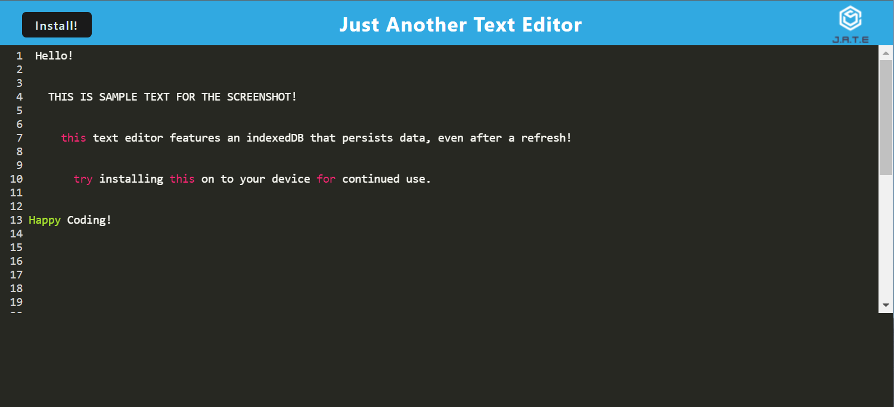

# 19 Progressive Web Applications (PWA): Text Editor

## Description

I created this Social Network API in order to create an interactive database where users can create a User, add other users as Friends, post Thoughts and add or remove Reactions to those Thoughts. I am able to view Users, their associated friends, Thoughts, and associated Reactions. I am able to add Users, update Users, remove Users, add other users as Friends, remove Users as friends, create Thoughts, update Thoughts, remove Thoughts, React to thoughts, and remove Reactions from Thoughts. This application utilizes Node and Express.js to create the application routes, MongoDB and mongoose to create and modify the database, and Insomnia to test and present all working capabilities. I learned how to improve coding structure and accessibility of MongoDB databases utilizing mongoose, learned a new way to execute Express.js routes, and conducted testing of routes and database capabilities with Insomnia.

## Installation

This application can be accessed and utilized following Link:

In addition to this, you can install the application to your device by navigating to the link above, and clicking the "Install" button in the upper left hand portion of the page. Then, the application can be used in it's offline version on your device, as a stand-alone application.

## Usage

See the following Acceptance Criteria to understand how the application can be accessed and utilized:
GIVEN a text editor web application
WHEN I open my application in my editor
THEN I should see a client server folder structure
WHEN I run `npm run start` from the root directory
THEN I find that my application should start up the backend and serve the client
WHEN I run the text editor application from my terminal
THEN I find that my JavaScript files have been bundled using webpack
WHEN I run my webpack plugins
THEN I find that I have a generated HTML file, service worker, and a manifest file
WHEN I use next-gen JavaScript in my application
THEN I find that the text editor still functions in the browser without errors
WHEN I open the text editor
THEN I find that IndexedDB has immediately created a database storage
WHEN I enter content and subsequently click off of the DOM window
THEN I find that the content in the text editor has been saved with IndexedDB
WHEN I reopen the text editor after closing it
THEN I find that the content in the text editor has been retrieved from our IndexedDB
WHEN I click on the Install button
THEN I download my web application as an icon on my desktop
WHEN I load my web application
THEN I should have a registered service worker using workbox
WHEN I register a service worker
THEN I should have my static assets pre cached upon loading along with subsequent pages and static assets
WHEN I deploy to Heroku
THEN I should have proper build scripts for a webpack application

## Technologies Used

Node.js, Express.js CRUD operations, eslint, Webpack, HTML, CSS, Manifest, Github (store and edit code), Heroku (deploy webpage)

## License

NA
